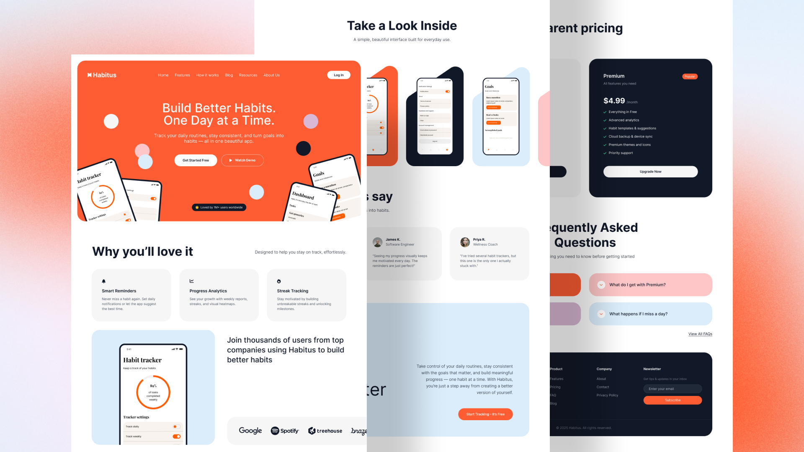

# Habitus — Habit Tracker App Landing Page

Pixel-perfect conversion of Figma designs to Next.js + Tailwind CSS — translating every spacing value, color token, and component structure from the design file into clean, maintainable React code. The result is a responsive, production-ready frontend that matches the original design at every breakpoint, without shortcuts or approximations.

---

## Cover Image

<!-- Add cover image here -->


---

## Design Attribution

- **Design by:** Olga ([@olgaaverchenko](https://www.figma.com/@olgaaverchenko))
- **Figma Community file:** [Habitus – Habit Tracker App Landing Page](https://www.figma.com/community/file/1507106587522840897/habitus-habit-tracker-app-landing-page)
- **Code by:** [pkhilmon](https://pavlokhilmon.com)

---

## Features

- **Hero section** — bold headline, CTA buttons, floating phone mockups, and decorative circles
- **Feature cards** — Smart Reminders, Progress Analytics, and Streak Tracking
- **Social proof** — company logo strip (Google, Spotify, Treehouse, Braze)
- **App Screenshots** — full-screen app UI showcase
- **Testimonials** — user reviews with avatars and star ratings
- **Pricing** — Free vs. Premium two-column comparison ($0 / $4.99 per month)
- **FAQ** — expandable frequently-asked-questions accordion
- **CTA** — secondary conversion section with app-store call to action
- **Footer** — links, social icons, and copyright
- **Fully responsive** — mobile-first layout that adapts from 375 px to 1440 px
- **Accessible markup** — semantic HTML, `alt` attributes on all images

---

## Performance

<!-- Add Lighthouse screenshot here -->


---

## Tech Stack

| Layer | Technology |
|---|---|
| Framework | [Next.js 16](https://nextjs.org) (App Router) |
| UI Library | [React 19](https://react.dev) |
| Styling | [Tailwind CSS v4](https://tailwindcss.com) |
| Language | TypeScript 5 |
| Utilities | `clsx`, `tailwind-merge` |
| Linting | ESLint 9 + `eslint-config-next` |

---

## Getting Started

**Prerequisites:** Node.js 18+

```bash
# Install dependencies
npm install

# Start the development server
npm run dev
```

Open [http://localhost:3000](http://localhost:3000) in your browser.

---

## Build & Deploy

```bash
# Production build
npm run build

# Preview the production build locally
npm start
```

**Deploy to Vercel** (recommended):

[](https://vercel.com/new)

Push to your GitHub repository and import it in the [Vercel dashboard](https://vercel.com/new). Zero configuration required — Next.js is auto-detected.

---

## Project Structure

```
site/
├── src/
│   ├── app/
│   │   ├── assets/          # SVG icons and PNG app screenshots
│   │   ├── globals.css      # Global styles and Tailwind theme
│   │   ├── layout.tsx       # Root layout (fonts, metadata)
│   │   └── page.tsx         # Home page — composes all sections
│   ├── components/
│   │   ├── Navbar.tsx
│   │   ├── Hero.tsx
│   │   ├── Features.tsx
│   │   ├── AppScreenshots.tsx
│   │   ├── Testimonials.tsx
│   │   ├── CTA.tsx
│   │   ├── Pricing.tsx
│   │   ├── FAQ.tsx
│   │   └── Footer.tsx
│   └── lib/
│       └── utils.ts         # cn() helper (clsx + tailwind-merge)
├── public/                  # Static assets served at /
├── next.config.ts
├── postcss.config.mjs
├── tailwind.config (inline in CSS)
├── tsconfig.json
└── package.json
```

---

## License

This project is released under the **Creative Commons Attribution 4.0 International (CC BY 4.0)** license.

You are free to share and adapt the material for any purpose, even commercially, as long as appropriate credit is given.

See [LICENSE](./LICENSE) for full terms.

---

## Acknowledgements

- [Olga (@olgaaverchenko)](https://www.figma.com/@olgaaverchenko) for the original Figma design
- [Next.js](https://nextjs.org) and [Vercel](https://vercel.com) for the framework and hosting platform
- [Tailwind CSS](https://tailwindcss.com) for the utility-first styling system
